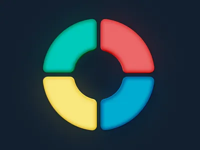

# Simon Says Game 🎮  

<div align="center">
  
  
  
</div>

  
*(Replace with actual screenshot)*

A classic memory challenge game built with HTML, CSS, and JavaScript.

## 🚀 Features
- 🔢 Increasingly complex sequences
- 🎨 Vibrant color buttons (Red, Yellow, Green, Purple)
- 💡 Visual feedback with flashing animations
- 📊 Score tracking by levels
- 🔄 One-key restart system

## 🕹️ How to Play
1. Press **any keyboard key** to start
2. **Memorize** the sequence of flashing buttons
3. **Click the buttons** in the same order
4. **Advance** to higher levels with longer sequences
5. **Game ends** if you make a mistake, showing your final score

## 🛠️ Technical Details
- **Game Logic**: Tracks both game-generated and user sequences
- **Visual Feedback**: Uses CSS classes for flash effects
- **Responsive Design**: Centered layout works on most screens
- **Event Listeners**: Keyboard and click handlers for interaction

## 📂 File Structure
simon-says/
├── index.html # Main HTML structure
├── style.css # Styling and animations
└── app.js # Game logic and functionality

## 🔮 Future Improvements
```diff
+ Add sound effects for each color button
+ Implement high score tracking
+ Create mobile touch optimizations
+ Add difficulty levels
+ Include a dark mode option
